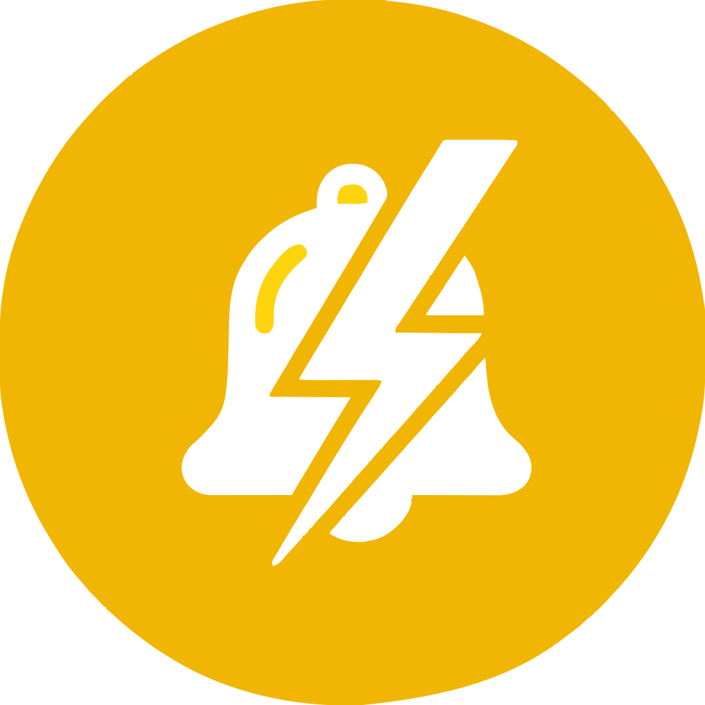

<p align="center">
  
</p>

# @notifi/core

Framework-agnostic, headless notifications core. No UI, no styles. Manages notification state and lifecycle.

Use this package directly if you are building an adapter or integrating into a non-Vue environment.

## Install

```bash
npm install @notifi/core
```

## Usage

```ts
import { notification, type ExternalNotification } from '@notifi/core'

// Create a notification (content can be any value your adapter understands)
const id = notification('Hello from core!', { duration: 3000 } as ExternalNotification)

// Dismiss by id or dismiss all
notification.dismiss(id)
notification.dismiss()

// Introspect state
const history = notification.getHistory()
const active = notification.getNotifications()
```

## API

```ts
// Create/update notification (returns id)
notification(component: any, data?: ExternalNotification): string | number

// Dismiss one or all
notification.dismiss(id?: string | number): string | number | undefined

// Read state
notification.getHistory(): Array<NotificationT>
notification.getNotifications(): Array<NotificationT>
```

Key types are exported:

- `NotificationT`
- `ExternalNotification`
- `NotificationContainerProps`
- `NotificationProps`
- `Position`, `SwipeDirection`

## Building adapters

- Render notifications from `notification.getNotifications()`.
- Subscribe to changes via `NotificationState.subscribe(cb)` if needed for fine-grained control.
- Respect `duration`, `dismissible`, `noPauseOnHover`, `position`, and call `notification.dismiss(id)` for external dismiss.

## License

MIT
